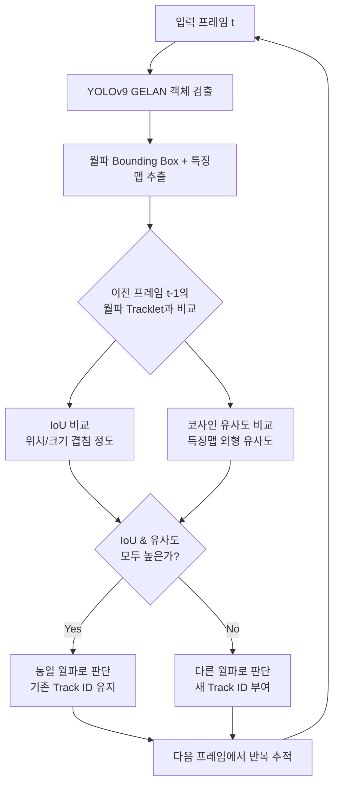
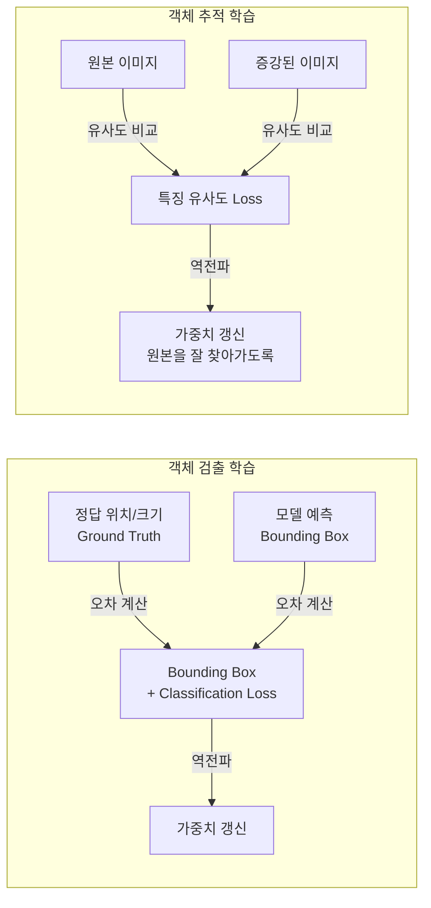
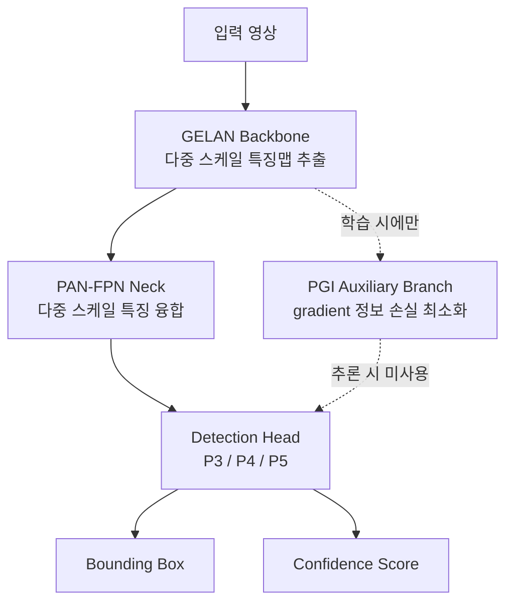
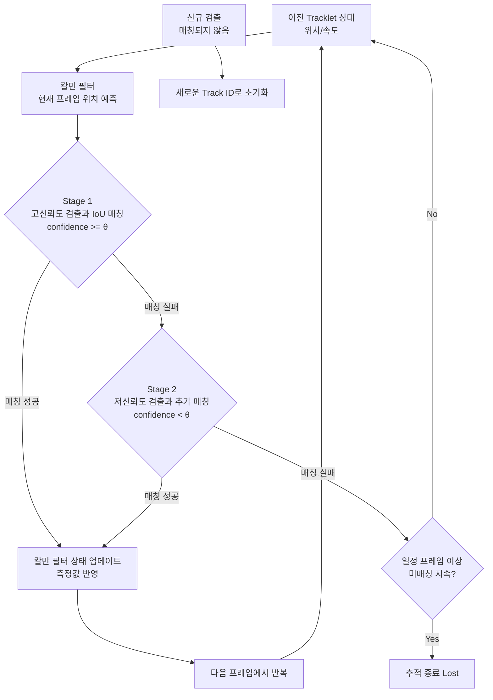

# 월파(Wave Overtopping) 검출 및 추적 시스템

YOLOv9(GELAN) 기반 객체 검출과 ByteTrack + 칼만 필터 기반 추적을 결합하여, 수리모형실험 영상에서 월파를 프레임별로 검출하고 동일 개체를 추적하는 파이프라인입니다.

## 1. 전체 파이프라인 구조

프레임마다 월파를 검출하고, 이전 프레임과의 겹침(IoU) 및 특징맵 유사도(코사인 유사도)를 함께 비교하여 동일한 월파인지 판단한 뒤 지속적으로 추적합니다.

## 2. 학습 구조

객체 검출과 추적은 서로 다른 방식으로 학습됩니다.

## 3. 객체 검출 모델 — YOLOv9 (GELAN)

- **Backbone (GELAN)**: 사전학습 가중치를 활용해 입력 영상에서 특징을 추출. PGI 기법으로 깊은 네트워크에서의 정보 손실(information bottleneck) 문제를 완화.
- **학습 단계**에서는 PGI의 Auxiliary Branch를 함께 사용해 gradient 정보 손실을 최소화하고, **추론 단계**에서는 Main Branch만 사용해 효율적으로 검출.
- **Neck (PAN-FPN)**: 서로 다른 stage의 feature map을 aggregation하여 다양한 크기의 월파를 효과적으로 검출.
- **Head**: P3/P4/P5 세 가지 스케일에서 Bounding Box와 Confidence Score를 예측.

### YOLOv7 대비 개선점

| 항목 | YOLOv7 (3차년도) | YOLOv9 (현재) |
|---|---|---|
| Backbone 구조 | CSPNet 기반 | GELAN 기반 |
| 정보 손실 대응 | 없음 | PGI로 gradient 정보 보존 |
| 파라미터 대비 성능 | 상대적으로 낮음 | 더 적은 파라미터로 더 높은 정확도 |

## 4. 객체 추적 — ByteTrack + 칼만 필터

- **Stage 1 (고신뢰도 매칭)**: 칼만 필터로 예측한 Tracklet 위치와 고신뢰도 검출 결과 간 IoU를 계산해 매칭.
- **Stage 2 (저신뢰도 매칭)**: Stage 1에서 매칭되지 않은 Tracklet을 저신뢰도 검출과 추가로 매칭 — 가려짐(occlusion)이나 모션 블러 상황에서도 추적 연속성 유지.
- **칼만 필터 업데이트**: 매칭 성공 시 실측 위치로 상태를 갱신해 다음 프레임 예측 정확도를 향상.
- 측면 영상에는 IOU tracker를 사용했으나 크기 변화·겹침/분리 구분에 취약해, 정면 영상에는 크기 변화에 강건하고 일시적 가려짐에도 추적이 유지되는 **ByteTrack**을 적용.

## 5. 학습 기법

- **전이학습**: MS COCO 사전학습 가중치 기반 Transfer Learning.
- **데이터 증강**: Mosaic, MixUp, 색상 변환, 기하학적 변환 등.
- **다중 손실 함수**: IoU Loss, Bounding Box Regression Loss, Classification Loss를 결합한 복합 손실.

## 6. 주요 스크립트

| 파일 | 설명 |
|---|---|
| [wave_tracking_optuna_final.py](wave_tracking_optuna_final.py) | Optuna를 이용한 ByteTrack/BoT-SORT 추적 하이퍼파라미터 튜닝 및 MOT metric 평가 |
| [wave_tracking_optuna1.py](wave_tracking_optuna1.py) | 추적 하이퍼파라미터 튜닝 초기 버전 |
| [tracking_metrics4.py](tracking_metrics4.py) | 추적 성능 지표(MOTA 등) 계산 |
| [reassign_continuous3.py](reassign_continuous3.py) | Track ID 재할당 후처리 |
| [threshold_filtering](threshold_filtering) | 방파제 위로 솟구치는 정도를 기준으로 한 월파 필터링 |
| [compare_overtopping_height.py](compare_overtopping_height.py) | 검출된 Bounding Box로부터 월파고 추정 및 비교 |
| [original_with_graph.py](original_with_graph.py) / [run_with_graph.py](run_with_graph.py) | 검출·추적 결과를 그래프와 함께 시각화 |
| [create_video_from_labels.py](create_video_from_labels.py) | 라벨 결과를 영상으로 변환 |
| [bytetrack_best.yaml](bytetrack_best.yaml) / [tracker_final.yaml](tracker_final.yaml) | 튜닝된 ByteTrack 설정 |

> 대용량 결과 영상(mp4)은 저장소 용량 문제로 `.gitignore` 처리되어 있으며, 로컬에서만 관리됩니다.
